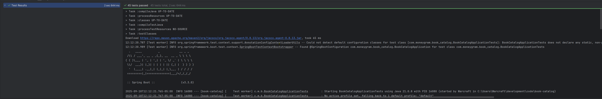
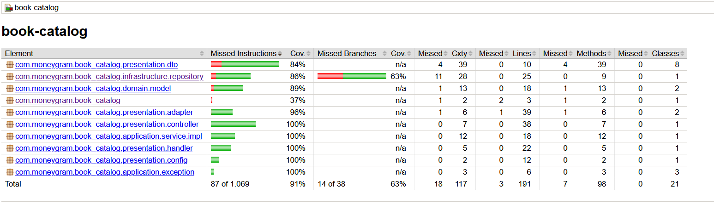

# Book Catalog API

Simple API REST for the books catalogue.

## Requirements

- Java 21.x
- Gradle 8.x
- Docker (optional)

## Setting Up the Project

1. Clone the repository:
```bash
git clone https://github.com/oscardospinar/book-catalog.git
cd book-catalog
```

2. Build the project:
```bash
./gradlew build
```

## Running the Application
### With Gradle
```bash
./gradlew bootRun
``` 
### With Docker
```bash
docker build -t book-catalog .
docker run -p 8080:8080 book-catalog
```
## Test
### Unit test
The project has a test suite with coverage of 90%, to run the test

```bash
./gradlew clean test
```


### Coverage

## Endpoints
- `GET /api/books`: Gets all the books.
- `GET /api/books/{id}`: Get a book by id.
- `POST /api/books`: Creates a new book.
- `PUT /api/books/{id}`: Update a book based on the id.
- `DELETE /api/books/{id}`: Deletes a book based on the id.
- `GET /api/books/search?title={title}`: Get books by title.


### Filters
The following filters could be use in `/api/books`:
 * `title`: Book title
 * `author`: Book author
 * `isbn`: Book ISBN
